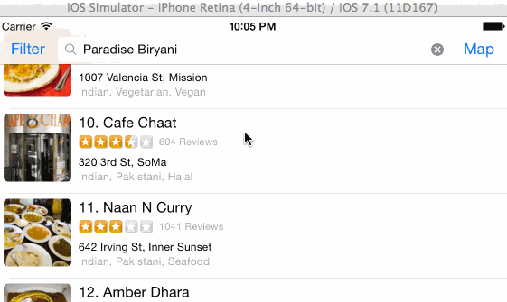

YelpIt!
=========================

Time spent:  28 hours spent in total

Completed User Stories: 

Search results page:
Required:

- [x] Table rows should be dynamic height according to the content height
- [x] Custom cells should have the proper Auto Layout constraints
- [x] Search bar should be in the navigation bar (doesn't have to expand to show location like the real Yelp app does).

Optional:

- [ ] Infinite scroll for restaurant results
- [x] Implement map view of restaurant results [Note: API does not provide with long/lat of a perticular buisness]. Configured a map view to show with the center long/lat and span provided by the api.

Filter Page:
Required: 
- [x] The filters you should actually have are: category, sort (best match, distance, highest rated), radius (meters), deals (on/off).
- [x] The filters table should be organized into sections as in the mock.
- [x] You can use the default UISwitch for on/off states. Optional: implement a custom switch
- [x] Radius filter should expand as in the real Yelp app
- [x] Categories should show a subset of the full list with a "See All" row to expand.
- [x] Clicking on the "Search" button should dismiss the filters page and trigger the search w/ the new filter settings.

Detail View Optional: 
- [x] Implement the restaurant detail page. [Note: Created a very basic detail page, with name, review snipped and phone #]

References Used: 

  1. Mantle : http://www.objc.at/mantle
  2. Add button to navigation bar. http://stackoverflow.com/questions/1219779/how-to-add-a-right-button-to-a-uinavigationcontroller
  3. Add Search Bar :  http://stackoverflow.com/questions/5095477/uisearchbar-in-navigationbar
  4. Auto cell Resizing (Very Helpful): http://blog.jldagon.me/blog/2013/12/07/auto-layout-and-uitableview-cells/
  5. Boolean Predicate: http://stackoverflow.com/questions/3670018/core-data-nspredicate-checking-for-bool-value
  6. Initliazers: https://developer.apple.com/library/ios/documentation/general/conceptual/CocoaEncyclopedia/Initialization/Initialization.html
  7. Array to String: http://stackoverflow.com/questions/12199619/construct-nsstring-from-the-description-method-of-each-nsarray-item
  8. Array to String: http://stackoverflow.com/questions/12199619/construct-nsstring-from-the-description-method-of-each-nsarray-item
  

A description of the project:

Project uses Yelp Api to pull data from search API async. It uses autolayout, the row height gets resized automatically. Used some table View tricks in the filter view. 

Issue: 
API does not provide with long/lat of the resturants for mapping. But gives the center long/lat and the span to create a map. Implemented that. 

LICENSE to the repository: 

Open-Source libraries used:

1. AFNetworking
2. BDBOAuth1Manager
3. Mantle
4. SVProgressHUD

Gif Image

AutoLayout: 

YelpIt  Due: June 17. 2014 10pm
